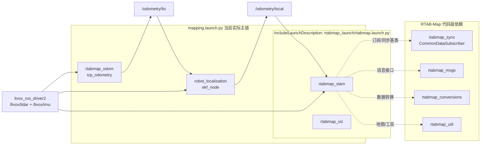
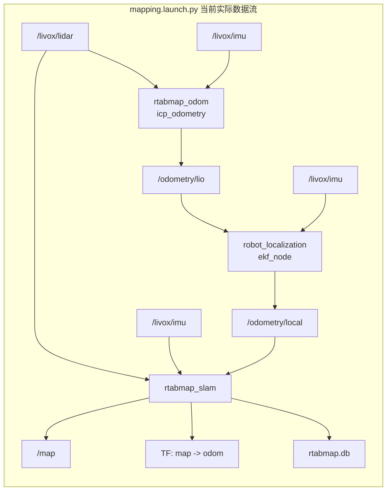

# RTAB-Map 导航项目（从零到一）
官方链接：https://github.com/introlab/rtabmap_ros

本仓库用于落地一套分层清晰的 ROS2 导航方案：

- `RTAB-Map` 负责全局建图/回环/重定位（发布 `map -> odom`）
- `robot_localization (EKF)` 负责本地连续里程计（发布 `odom -> base_footprint`）
- `Nav2` 负责规划、控制与避障执行
## 0.编译
```bash
do_build_all.sh  #直接编译就行
```

## 1. 仓库结构

```text
rtabmap_nav2_stack/                 # 工作空间
├── src/                            # ROS 2 工作空间源码目录
│   ├── robot_bringup/              # (未启用) 高级导航启动包组，包含 EKF 和 Nav2 的精细配置
│   │   ├── launch/                 # 启动脚本存放目录
│   │   │   ├── bringup.launch.py   # 总启动入口，控制全自动导航的各个模块
│   │   │   └── rtabmap_bridge.launch.py # 负责将 RTAB-Map 的输出桥接到 Nav2 栈
│   │   └── config/                 # 核心参数配置目录
│   │       ├── ekf_local.yaml      # 扩展卡尔曼滤波(EKF)配置，用于融合 Lidar, IMU, 轮速里程计
│   │       └── nav2_common.yaml    # Navigation 2 配置
│   └── rtabmap_ros/                # 官方 RTAB-Map ROS 2 包装层
│       ├── rtabmap_launch/         # （done）通用 Launch 入口，  目前的脚本走的就是这个
│       ├── rtabmap_slam/           # （done）SLAM 核心节点，负责建图、回环检测、图优化与重定位
│       ├── rtabmap_odom/           # （done）视觉/深度/激光前端里程计节点，提供局部连续位姿估计
│       ├── rtabmap_sync/           # （done）多传感器时间同步节点，将 RGB、Depth、Scan、IMU 整理成统一输入
│       ├── rtabmap_util/           # （done）点云、栅格、图像和 TF 处理工具节点集合
│       ├── rtabmap_msgs/           # （done）RTAB-Map  ROS 2 消息与服务类型定义
│       ├── rtabmap_conversions/    # （done）RTAB-Map C++ 核心数据结构与 ROS 消息/TF/OpenCV 之间的转换库
│       ├── rtabmap_rviz_plugins/   # （done）RViz 中显示地图图结构、点云、回环和调试信息的插件
│       ├── rtabmap_viz/            # （done）RTAB-Map 自带可视化界面节点，便于查看节点图、回环和局部地图
│       ├── rtabmap_costmap_plugins/# （done）给 Nav2提供3D体素地图能力，
│       ├── rtabmap_python/         # （done）Python 绑定与脚本接口，便于离线分析和轻量二次开发
│       ├── rtabmap_ros/            # （done）元包/聚合包，用于统一依赖导出和整体发布
│       ├── rtsp_camera_bridge/     # （不用理，不是原生包）RTSP 相机桥接节点，把网络视频流接入 ROS 图像话题
│       ├── rtabmap_examples/       # （done）单体传感器或典型设备（如 Realsense）的使用示例
│       └── rtabmap_demos/          # （done）完整机器人的离线建图仿真与演示程序
├── third_party/                    #
│   └── rtabmap-0.23.4/             # RTAB-Map C++ 核心算法源码，保证版本一致性
├── scripts/                        # 编译和配置脚本
│   ├── build_rtabmap_0234.sh       # （done）隔离编译 RTAB-Map 核心层脚本
│   └── use_rtabmap_0234_env.sh     # （done）供 colcon 编译时挂载核心库路径的环境脚本
```

## 2.建图过程  

`src/robot_bringup/` 目前是本地 `launch/config` 目录，不是独立 ROS 包。
下面只画本项目里实际参与建图的 ROS 包，以及它们和外部雷达驱动输入的关系。

### 2.1  包协作过程



- 当前 `mapping.launch.py` 主链不是单纯 `robot_localization -> /odometry/local -> rtabmap_slam`，前面还有 `rtabmap_odom::icp_odometry -> /odometry/lio` 这一段
- `mapping.launch.py` 里显式启动了 `rtabmap_odom/icp_odometry`，它是 `/odometry/lio` 的实际发布者
- `robot_localization` 把 `/odometry/lio` 和 `/livox/imu` 融合成 `/odometry/local`
- `rtabmap_slam` 消费 `/odometry/local`、`/livox/lidar` 和 `/livox/imu`，并发布 `map -> odom`
- 当前配置下，`rtabmap_launch` 内部自带的 odometry 支路被关闭：`visual_odometry = false`、`icp_odometry = false`
- 这里要区分两件事：当前工程使用了 `rtabmap_odom` 包，但不是通过 `rtabmap_launch` 内部再起一套 odom，而是由 `mapping.launch.py` 单独起 `icp_odometry` 节点

### 2.2  关键数据流向



最终 TF 主链：

```text
map -> odom -> base_footprint -> base_link -> lidar/imu
```
