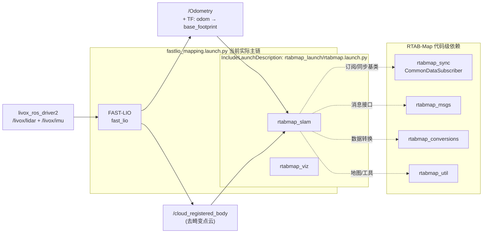
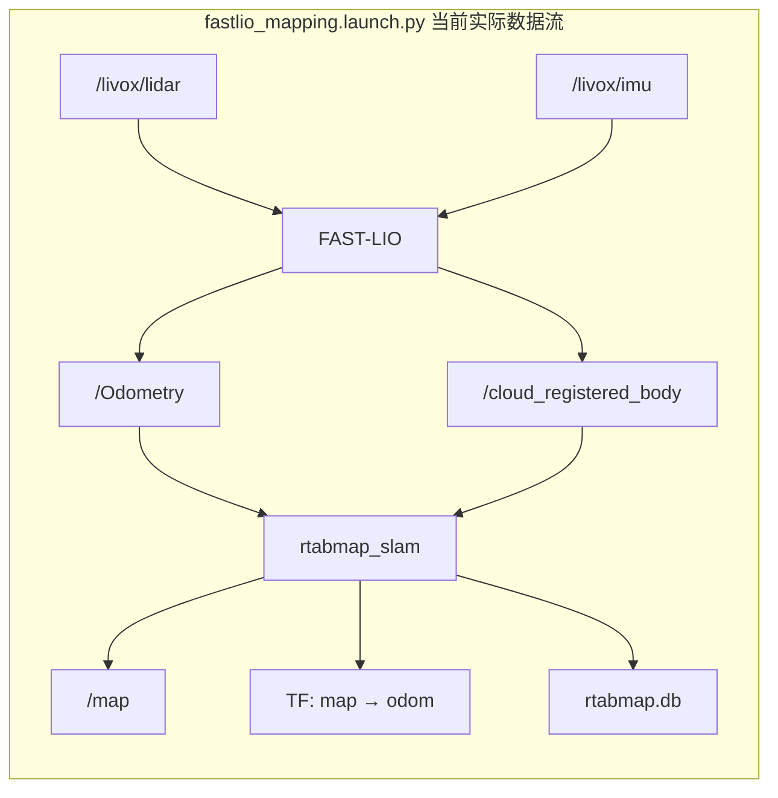
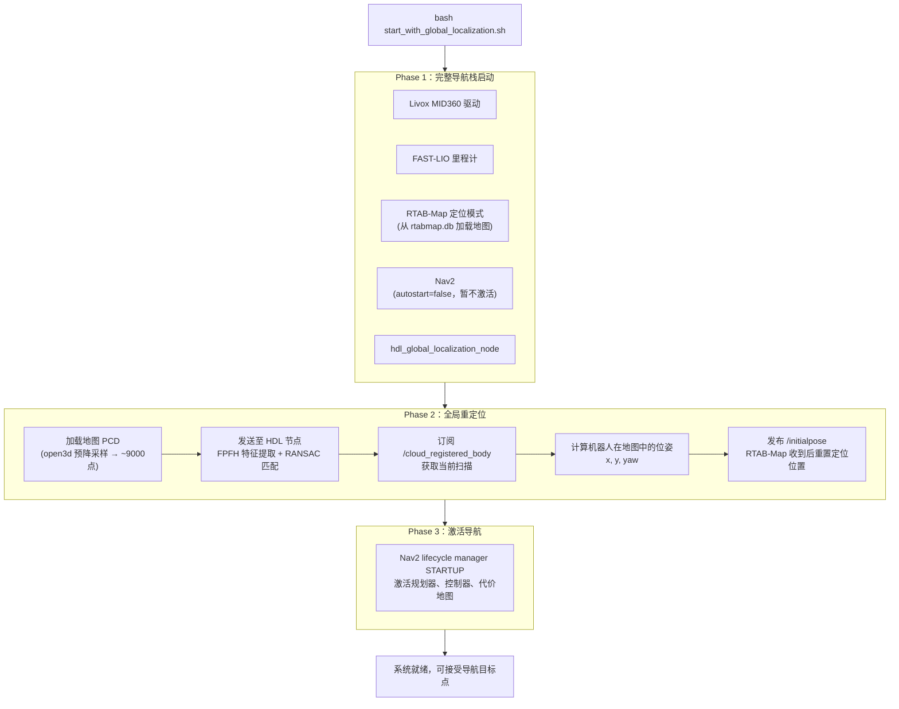

# RTAB-Map 导航项目（从零到一）
官方链接：https://github.com/introlab/rtabmap_ros

本仓库用于落地一套分层清晰的 ROS2 导航方案：

- `FAST-LIO` 负责雷达惯性里程计（发布 `odom -> base_footprint`）
- `RTAB-Map` 负责全局建图/回环/重定位（发布 `map -> odom`）
- `Nav2` 负责规划、控制与避障执行
## 0. 编译与运行环境

### 0.1 运行环境

本项目按以下环境整理和验证：

| 项目 | 版本 / 说明 |
|---|---|
| OS | Ubuntu 22.04 |
| ROS | ROS 2 Humble |
| 机器人平台 | Wheeltec 底盘，Livox MID360 激光雷达 |
| 核心链路 | Livox 驱动 + FAST-LIO + RTAB-Map + Nav2 |
| 导航输入 | RTAB-Map 发布 `/map` 和 `map -> odom`，FAST-LIO 发布 `/Odometry` 和 `odom -> base_footprint` |
| 导航输出 | Nav2 输出 `/cmd_vel_nav`，再经过 `nav2_collision_monitor` 转发到 `/cmd_vel` |

> 运行前请确认已经 source ROS 2 环境：`source /opt/ros/humble/setup.bash`。

### 0.2 编译

```bash
cd ~/xz/rtabmap_nav2_stack
source /opt/ros/humble/setup.bash
bash scripts/do_build_all.sh
```

`scripts/do_build_all.sh` 会先准备 RTAB-Map 0.23.4 的本地库环境，再执行工作空间 `colcon build`。编译完成后，新终端运行前需要执行：

```bash
cd ~/xz/rtabmap_nav2_stack
source install/setup.bash
```

如果修改了 C++ 包、消息/服务接口或 Nav2 插件相关配置，建议清理后重编：

```bash
rm -rf build install log
bash scripts/do_build_all.sh
```

## 1. 仓库结构

```text
rtabmap_nav2_stack/                 # 工作空间
├── src/                            # ROS 2 工作空间源码目录
│   ├── robot_bringup/              # 高级导航启动包组，包含 Nav2 的精细配置
│   │   ├── launch/                 # 启动脚本存放目录
│   │   │   ├── fastlio_mapping.launch.py # 当前建图主入口（FAST-LIO + RTAB-Map）
│   │   │   ├── bringup.launch.py   # 总启动入口，控制全自动导航的各个模块
│   │   │   └── rtabmap_bridge.launch.py # 负责将 RTAB-Map 的输出桥接到 Nav2 栈
│   │   └── config/                 # 核心参数配置目录
│   │       └── nav2_common.yaml    # Navigation 2 配置
│   ├── FAST_LIO_ROS2/              # FAST-LIO 激光惯性紧耦合里程计（提供 odom 和去畸变点云）
│   ├── livox_ros_driver2/          # Livox MID360 雷达驱动
│   └── rtabmap_ros/                # 官方 RTAB-Map ROS 2 包装层
│       ├── rtabmap_launch/         # （done）通用 Launch 入口，  目前的脚本走的就是这个
│       ├── rtabmap_slam/           # （done）SLAM 核心节点，负责建图、回环检测、图优化与重定位
│       ├── rtabmap_odom/           # （done）视觉/深度/激光前端里程计节点，提供局部连续位姿估计
│       ├── rtabmap_sync/           # （done）多传感器时间同步节点，将 RGB、Depth、Scan、IMU 整理成统一输入
│       ├── rtabmap_util/           # （done）点云、栅格、图像和 TF 处理工具节点集合
│       ├── rtabmap_msgs/           # （done）RTAB-Map  ROS 2 消息与服务类型定义
│       ├── rtabmap_conversions/    # （done）RTAB-Map C++ 核心数据结构与 ROS 消息/TF/OpenCV 之间的转换库
│       ├── rtabmap_rviz_plugins/   # （done）RViz 中显示地图图结构、点云、回环和调试信息的插件
│       ├── rtabmap_viz/            # （done）RTAB-Map 自带可视化界面节点，便于查看节点图、回环和局部地图
│       ├── rtabmap_costmap_plugins/# （done）给 Nav2提供3D体素地图能力，
│       ├── rtabmap_python/         # （done）Python 绑定与脚本接口，便于离线分析和轻量二次开发
│       ├── rtabmap_ros/            # （done）元包/聚合包，用于统一依赖导出和整体发布
│       ├── rtsp_camera_bridge/     # （不用理，不是原生包）RTSP 相机桥接节点，把网络视频流接入 ROS 图像话题
│       ├── rtabmap_examples/       # （done）单体传感器或典型设备（如 Realsense）的使用示例
│       └── rtabmap_demos/          # （done）完整机器人的离线建图仿真与演示程序
├── third_party/                    #
│   └── rtabmap-0.23.4/             # RTAB-Map C++ 核心算法源码，保证版本一致性
├── scripts/                        # 编译和配置脚本
│   ├── build_rtabmap_0234.sh       # （done）隔离编译 RTAB-Map 核心层脚本
│   └── use_rtabmap_0234_env.sh     # （done）供 colcon 编译时挂载核心库路径的环境脚本
```

## 2.建图过程  

当前建图主入口为 `fastlio_mapping.launch.py`，使用 FAST-LIO 取代了之前的 icp_odometry + EKF 方案。

### 2.1  包协作过程


```mermaid
flowchart LR
    LIVOX["livox_ros_driver2\n/livox/lidar + /livox/imu"] --> FASTLIO["FAST-LIO\nfast_lio"]
    FASTLIO --> ODOM["/Odometry\n+ TF: odom → base_footprint"]
    FASTLIO --> CLOUD_REG["/cloud_registered_body\n(去畸变点云)"]

    ODOM --> SL
    CLOUD_REG --> SL

    subgraph R1["fastlio_mapping.launch.py 当前实际主链"]
        FASTLIO
        subgraph RTAB_LAUNCH["IncludeLaunchDescription: rtabmap_launch/rtabmap.launch.py"]
            SL["rtabmap_slam"]
            VIZ["rtabmap_viz"]
        end
    end

    subgraph R2["RTAB-Map 代码级依赖"]
        SL -.订阅/同步基类.-> SYNC_BASE["rtabmap_sync\nCommonDataSubscriber"]
        SL -.消息接口.-> MSG["rtabmap_msgs"]
        SL -.数据转换.-> CONV["rtabmap_conversions"]
        SL -.地图/工具.-> UTIL["rtabmap_util"]
    end
```

- FAST-LIO 直接消费 `/livox/lidar` 和 `/livox/imu`，输出激光惯性紧耦合里程计 `/Odometry`，同时发布 `odom -> base_footprint` TF
- FAST-LIO 还输出去运动畸变后的点云 `/cloud_registered_body`，供 RTAB-Map 做回环检测和建图
- `rtabmap_slam` 消费 `/Odometry` 和 `/cloud_registered_body`，执行图优化并发布 `map -> odom` TF
- 不再使用 `icp_odometry`、`robot_localization (EKF)` 等中间环节，链路更短更简洁

### 2.2  关键数据流向


```mermaid
flowchart LR
    subgraph A["fastlio_mapping.launch.py 当前实际数据流"]
        CLOUD["/livox/lidar"] --> FASTLIO["FAST-LIO"]
        IMU1["/livox/imu"] --> FASTLIO
        FASTLIO --> ODOM["/Odometry"]
        FASTLIO --> CLOUD_REG["/cloud_registered_body"]

        ODOM --> SLAM["rtabmap_slam"]
        CLOUD_REG --> SLAM
        SLAM --> MAP["/map"]
        SLAM --> TF1["TF: map → odom"]
        SLAM --> DB1["rtabmap.db"]
    end

```

最终 TF 主链：

```text
map → odom → base_footprint → base_link → livox_frame
 ↑      ↑        (static)       (static)
rtabmap FAST-LIO
```

## 3. 全局重定位与导航启动

### 3.1 新增文件说明

| 文件 | 说明 |
|---|---|
| `src/hdl_global_localization-humble/` | HDL 全局定位 C++ 包（ROS2 Humble 适配版），提供 FPFH+RANSAC 点云匹配服务 |
| `scripts/extract_pcd_from_db.py` | 从 `rtabmap.db` 导出全局点云地图为 PCD 文件 |
| `scripts/global_localization_node.py` | Python 客户端：加载地图 PCD → 调用 HDL 定位服务 → 发布 `/initialpose` |
| `scripts/start_with_global_localization.sh` | **一键启动脚本**，完成三阶段全自动导航启动 |

### 3.2 整体流程


```mermaid
flowchart TD
    A["bash start_with_global_localization.sh"] --> B

    subgraph B["Phase 1：完整导航栈启动"]
        B1["Livox MID360 驱动"]
        B2["FAST-LIO 里程计"]
        B3["RTAB-Map 定位模式\n(从 rtabmap.db 加载地图)"]
        B4["Nav2\n(autostart=false，暂不激活)"]
        B5["hdl_global_localization_node"]
    end

    B --> C

    subgraph C["Phase 2：全局重定位"]
        C1["加载地图 PCD\n(open3d 预降采样 → ~9000点)"]
        C2["发送至 HDL 节点\nFPFH 特征提取 + RANSAC 匹配"]
        C3["订阅 /cloud_registered_body\n获取当前扫描"]
        C4["计算机器人在地图中的位姿\nx, y, yaw"]
        C5["发布 /initialpose\nRTAB-Map 收到后重置定位位置"]
        C1 --> C2 --> C3 --> C4 --> C5
    end

    C --> D

    subgraph D["Phase 3：激活导航"]
        D1["Nav2 lifecycle manager STARTUP\n激活规划器、控制器、代价地图"]
    end

    D --> E["系统就绪，可接受导航目标点"]
```

### 3.3 前置条件：导出全局地图

**建图完成后执行一次**，后续无需重复（地图不变则 PCD 不变）：

```bash
python3 scripts/extract_pcd_from_db.py
# 输出到 cloud_map/rtabmap_<timestamp>_cloud.pcd
```

> 默认读取 `/data/maps/site_a/rtabmap.db`，可通过参数指定：
> `python3 scripts/extract_pcd_from_db.py /path/to/rtabmap.db`

### 3.4 启动导航

```bash
bash scripts/start_with_global_localization.sh
```

可选参数：

```bash
# 指定地图数据库
bash scripts/start_with_global_localization.sh --db /data/maps/site_a/rtabmap.db

# 开启 RViz
bash scripts/start_with_global_localization.sh --rviz
```

### 3.5 关键话题与 TF

| 话题 / TF | 发布者 | 说明 |
|---|---|---|
| `/cloud_registered_body` | FAST-LIO | 当前帧去畸变点云（用于全局定位匹配） |
| `/initialpose` | global_localization_node.py | 全局定位结果，RTAB-Map 订阅后重置位置 |
| `map → odom` TF | RTAB-Map | 接收 `/initialpose` 后从正确位置发布 |
| `odom → base_footprint` TF | FAST-LIO | 连续里程计 |

### 3.6 重定位算法说明

使用 **FPFH + RANSAC** 三维点云全局配准（hdl_global_localization FPFH_RANSAC 引擎）：

1. 对全局地图 PCD 提取 FPFH（Fast Point Feature Histogram）33维局部几何特征
2. 对当前 LiDAR 扫描同样提取 FPFH
3. RANSAC 随机采样特征对应关系，SVD 求解刚体变换
4. 输出机器人在地图坐标系下的 `(x, y, yaw)`，`z/roll/pitch` 强制为 0（地面机器人）

关键参数（已针对室内 ~15m 场景调优）：

| 参数 | 值 | 说明 |
|---|---|---|
| 地图降采样分辨率 | 0.2m | 在 Python 端预处理，避免传输大消息 |
| 法向量估计半径 | 0.5m | 适合室内尺度 |
| FPFH 搜索半径 | 1.5m | 保证特征区分度 |

### 3.7 重定位耗时参考

| 阶段 | 耗时 |
|---|---|
| Phase 1 bringup 等待 | ~10 秒 |
| 地图 PCD 加载 + 发送 | ~2 秒 |
| FPFH 特征计算（地图） | ~30-90 秒（取决于 CPU） |
| RANSAC 匹配 + 发布结果 | ~5-15 秒 |
| **总计** | **约 1-2 分钟** |

### 3.8 停止

`Ctrl+C` 即可，脚本会自动 kill 所有相关进程（包括 rtabmap、fastlio、livox 等子进程）。

## 4. 多路路径点执行

该功能用于在 RViz 中手动取路径点，不使用固定路径库。RViz 使用 `Publish Point` 工具点选多个点，节点订阅 `/clicked_point` 收集路径点，再通过 Nav2 `/follow_waypoints` 执行。

单独启动路径点管理节点，并指定地图：

```bash
source /opt/ros/humble/setup.bash
source install/setup.bash
ros2 launch robot_bringup multi_waypoint_routes.launch.py map_id:=site_a map_frame_id:=map
```

随导航一起启动，并指定地图：

```bash
source /opt/ros/humble/setup.bash
source install/setup.bash
ros2 launch robot_bringup bringup.launch.py \
  mode:=navigation \
  database_path:=/data/maps/site_a/rtabmap.db \
  start_multi_waypoint_routes:=true \
  waypoint_map_id:=site_a \
  waypoint_map_frame_id:=map
```

也可以直接用脚本启动，脚本会自动 source 正确工作空间：

```bash
bash scripts/start_multi_waypoint_navigation.sh --map site_workspace --rviz
```

RViz 操作：

1. Fixed Frame 设为 `map`
2. 选择工具栏 `Publish Point`
3. 按顺序在地图上点击多个路径点
4. 在 RViz 中添加 `MarkerArray` 显示，话题选择 `/multi_waypoint_route/markers`

执行当前手动点选的路径：

```bash
ros2 topic pub --once /multi_waypoint_route/command std_msgs/msg/String "{data: 'start'}"
```

控制命令：

```bash
ros2 topic pub --once /multi_waypoint_route/command std_msgs/msg/String "{data: 'undo'}"
ros2 topic pub --once /multi_waypoint_route/command std_msgs/msg/String "{data: 'clear'}"
ros2 topic pub --once /multi_waypoint_route/command std_msgs/msg/String "{data: 'pause'}"
ros2 topic pub --once /multi_waypoint_route/command std_msgs/msg/String "{data: 'resume'}"
ros2 topic pub --once /multi_waypoint_route/command std_msgs/msg/String "{data: 'skip'}"
ros2 topic pub --once /multi_waypoint_route/command std_msgs/msg/String "{data: 'cancel'}"
```

状态与当前点列表：

```bash
ros2 topic echo /multi_waypoint_route/status
ros2 topic echo /multi_waypoint_route/points
```

如果在 RViz 中给目标点后没有出现 Path，可按 `docx/RViz目标点无Path排查README.md` 排查 Nav2 状态、TF、地图、代价地图和禁行区配置。

## 5. 局部代价地图动态障碍残留优化

当前 Nav2 参数已将局部和全局动态障碍层从默认 `nav2_costmap_2d::VoxelLayer` 切换为 `spatio_temporal_voxel_layer/SpatioTemporalVoxelLayer`。该方案通过时间衰减降低动态障碍离开后的 costmap 残留，重点配置在：

```text
src/robot_bringup/config/nav2_common.yaml
src/robot_bringup/config/nav2_forbidden_area.yaml
```

完整说明、参数含义、验证方法和回退方式见 `docx/stvl_local_costmap_technical_report.md`。部署前需要确认目标机器已安装或能编译 `spatio_temporal_voxel_layer`，否则 Nav2 costmap 插件会加载失败。

## 6. DWB/MPPI 控制器版本

当前版本支持在启动时选择 Nav2 局部控制器：

```bash
# 默认 DWB
ros2 launch robot_bringup bringup.launch.py mode:=navigation nav2_controller:=dwb

# 切换 MPPI
ros2 launch robot_bringup bringup.launch.py mode:=navigation nav2_controller:=mppi
```

也可以直接指定完整参数文件，`nav2_params_file` 优先级高于 `nav2_controller`：

```bash
ros2 launch robot_bringup bringup.launch.py \
  mode:=navigation \
  nav2_params_file:=/home/wheeltec/xz/rtabmap_nav2_stack/install/robot_bringup/share/robot_bringup/config/nav2_mppi.yaml
```

相关文件：

```text
src/robot_bringup/config/nav2_dwb.yaml
src/robot_bringup/config/nav2_mppi.yaml
src/robot_bringup/scripts/nav2_controller_monitor.py
src/nav2_controller_benchmark/
```

`nav2_common.yaml` 和 `nav2_forbidden_area.yaml` 当前默认调为 DWB 参数，便于现场稳定运行；MPPI 参数保留在 `nav2_mppi.yaml` 中用于对比和回退。控制器运行时 CPU、内存、输出频率和计算耗时测试方法见 `src/nav2_controller_benchmark/README.md`。

如果需要绕过 `collision_monitor` 直接观察 Nav2 控制器输出，可临时传入：

```bash
ros2 launch robot_bringup bringup.launch.py \
  mode:=navigation \
  nav2_controller:=dwb \
  enable_collision_monitor:=false
```

## 7. 编译与部署注意事项

本章适用于把仓库部署到另一台机器狗或重新安装系统后的恢复。部署时必须区分三类内容：源码、编译产物和运行地图数据。

### 7.1 版本基线

当前项目验证环境如下：

| 项目 | 版本 / 要求 |
|---|---|
| Ubuntu | 22.04 LTS |
| CPU 架构 | ARM64（NVIDIA Jetson） |
| ROS | ROS 2 Humble |
| JetPack / CUDA | JetPack 6.2 / CUDA 12.6（当前开发机） |
| Python | 3.10 |
| CMake | 3.22 |
| GCC / G++ | 11.4 |
| OpenCV | 4.8.0 |
| PCL | 1.12.1 |
| RTAB-Map C++ 核心 | 0.23.4，使用仓库 `third_party/rtabmap-0.23.4` 编译 |
| `rtabmap_ros` | 0.23.4，使用仓库 `src/rtabmap_ros` 编译 |
| ROS 2 构建工具 | `colcon` + `ament_cmake` |

目标机器应尽量保持相同的 Ubuntu、ROS、架构和主要依赖版本。不要把 ARM64 编译产物复制到 x86_64，也不要把其他 JetPack、ROS 发行版或旧系统上的 `build/`、`install/` 直接拿来运行。

### 7.2 仓库中应该上传的内容

必须上传：

```text
src/                            ROS 2 包源码
scripts/                        构建、启动和地图处理脚本
third_party/rtabmap-0.23.4/     RTAB-Map 0.23.4 源码
README.md                       使用说明
```

不要上传或跨机器复用：

```text
build/
install/
log/
third_party/rtabmap-0.23.4/build_local/
third_party/rtabmap-0.23.4/install/
```

这些目录包含本机绝对路径、CMake 缓存、软链接和特定架构的动态库。即使上传后看起来文件齐全，也可能出现包来自旧目录、动态库 ABI 不匹配或运行时加载错误版本等问题。

### 7.3 地图数据不会随 Git 自动部署

`.gitignore` 默认忽略以下运行数据：

```text
*.db
*.pcd
cloud_map/
*.bag
*.mcap
```

导航部署至少需要单独复制：

```text
/data/maps/<map_id>/rtabmap.db          RTAB-Map 地图数据库
<workspace>/cloud_map/<global_map>.pcd  HDL 全局定位使用的点云地图
```

推荐在目标机器建立固定地图目录：

```bash
sudo mkdir -p /data/maps/site_a
sudo chown -R "$USER":"$USER" /data/maps/site_a
cp /地图备份目录/rtabmap.db /data/maps/site_a/rtabmap.db

mkdir -p cloud_map
cp /地图备份目录/global_map.pcd cloud_map/
```

检查文件存在且不是空文件：

```bash
ls -lh /data/maps/site_a/rtabmap.db
find cloud_map -maxdepth 1 -type f -name '*.pcd' -ls
```

地图数据库通常可以由 RTAB-Map 0.23.4 读取 0.22.0 创建的数据，但升级前必须保留原始备份。不要依赖 0.22.0 反向读取已经被 0.23.4 更新过的数据库。

### 7.4 目标机器首次准备

先安装 ROS 2 Humble、colcon、rosdep 和项目依赖。以下命令应在仓库根目录执行：

```bash
cd ~/xz/rtabmap_nav2_stack
source /opt/ros/humble/setup.bash

sudo rosdep init 2>/dev/null || true
rosdep update
rosdep install --from-paths src --ignore-src -r -y
```

`rosdep` 不一定能安装 Jetson 定制 OpenCV、Livox SDK、Open3D 或硬件驱动的全部依赖。如果构建脚本报告缺少库，应根据报错安装对应开发包，不能通过复制旧机器的 `install/` 规避依赖安装。

Livox SDK2 源码必须完整存在。部署前检查：

```bash
test -d src/livox_ros_driver2/3rdparty/Livox-SDK2 && echo OK
```

如果仓库使用 Git 子模块或嵌套仓库获取 SDK，应在首次克隆时执行：

```bash
git submodule update --init --recursive
```

### 7.5 必须在目标机器干净编译

首次部署、切换机器、切换 ROS/JetPack/OpenCV，或 RTAB-Map 版本发生变化时，必须清理后完整编译：

```bash
cd ~/xz/rtabmap_nav2_stack
rm -rf build install log
rm -rf third_party/rtabmap-0.23.4/build_local
rm -rf third_party/rtabmap-0.23.4/install

source /opt/ros/humble/setup.bash
CLEAN_BUILD=1 bash scripts/do_build_all.sh
```

内存较小或编译时被系统杀死，可降低并行度：

```bash
JOBS=4 WORKERS=2 HEAVY_JOBS=1 bash scripts/do_build_all.sh
```

构建脚本会：

1. 检测目标机器的 OpenCV CMake 配置。
2. 将 RTAB-Map 0.23.4 编译到 `third_party/rtabmap-0.23.4/install`。
3. 设置 `RTABMap_DIR`、`CMAKE_PREFIX_PATH` 和 `LD_LIBRARY_PATH`。
4. 分阶段编译 RTAB-Map ROS 包、FAST-LIO、Livox 驱动和项目包。
5. 检查 RTAB-Map CMake 包版本必须为 0.23.4。

不要单独执行普通的 `colcon build` 来替代首次完整构建，否则 `find_package(RTABMap)` 可能找到系统安装的 0.22.0。

### 7.6 RTAB-Map 0.23.4 与系统 0.22.0

系统通过 apt 安装 `ros-humble-rtabmap*` 0.22.0 时，可以与项目的 0.23.4 共存，但不能混合链接或混合运行：

```text
RTAB-Map C++ 核心 0.23.4  <-> rtabmap_ros 0.23.4
RTAB-Map C++ 核心 0.22.0  <-> rtabmap_ros 0.22.0
```

本项目必须使用第一组。每个新终端建议按以下顺序加载环境：

```bash
cd ~/xz/rtabmap_nav2_stack
source /opt/ros/humble/setup.bash
source scripts/use_rtabmap_0234_env.sh
source install/setup.bash
```

然后确认实际版本和包来源：

```bash
rtabmap --version
ros2 pkg prefix rtabmap_ros
ros2 pkg prefix rtabmap_slam
```

预期结果：

```text
RTAB-Map: 0.23.4
ros2 pkg prefix 输出当前工作空间下的 install/...，而不是 /opt/ros/humble
```

如果显示 0.22.0 或 `/opt/ros/humble`，说明终端环境加载错误。关闭该终端重新 source，不要继续启动导航。

还可以检查节点实际链接的动态库：

```bash
RTABMAP_NODE="$(ros2 pkg prefix rtabmap_slam)/lib/rtabmap_slam/rtabmap"
ldd "$RTABMAP_NODE" | grep -i rtabmap
```

输出应指向本项目 `third_party/rtabmap-0.23.4/install/lib`，不能同时出现 0.22.0 和 0.23.4 的库路径。

### 7.7 工作空间叠加顺序

如果机器还安装了 `wheeltec_ros2` 或其他 ROS 2 工作空间，source 顺序决定最终使用哪个同名包。通用顺序是：

```bash
source /opt/ros/humble/setup.bash
source ~/wheeltec_ros2/install/setup.bash       # 底盘基础工作空间（如果需要）
source scripts/use_rtabmap_0234_env.sh
source ~/xz/rtabmap_nav2_stack/install/setup.bash
```

最后 source 的工作空间优先级最高。部署后务必检查：

```bash
ros2 pkg prefix nav2_bringup
ros2 pkg prefix robot_bringup
ros2 pkg prefix rtabmap_ros
```

不要在不同终端使用不同的 source 顺序后分别启动同一套导航节点，否则可能出现消息接口、插件和参数版本不一致。

### 7.8 路径和权限注意事项

启动文件默认地图路径为：

```text
/data/maps/site_a/rtabmap.db
```

如果目标机器使用不同地图，启动时必须显式传入 `--db`。全局定位使用的 PCD 也建议显式传入 `--pcd`，避免自动选中错误地图：

```bash
bash scripts/start_with_global_localization.sh \
  --db /data/maps/site_a/rtabmap.db \
  --pcd "$PWD/cloud_map/global_map.pcd" \
  --rviz
```

检查当前用户对数据库和设备有权限：

```bash
test -r /data/maps/site_a/rtabmap.db && echo 'database readable'
test -w /data/maps/site_a/rtabmap.db && echo 'database writable'
ls -l /dev/ttyUSB* /dev/ttyACM* 2>/dev/null
```

若使用串口，通常需要把用户加入 `dialout` 组并重新登录：

```bash
sudo usermod -aG dialout "$USER"
```

配置文件中不应写死旧机器用户名或工作空间绝对路径。迁移前可检查：

```bash
rg -n '/home/[^/]+/|/data/maps/' README.md scripts src/robot_bringup
```

其中 `/data/maps/...` 可以作为约定的数据目录；指向旧用户目录的 `/home/...` 路径必须改为目标机器路径，或改用 ROS 包共享目录解析。

### 7.9 启动导航前的完整检查

每次部署后先执行：

```bash
cd ~/xz/rtabmap_nav2_stack
source /opt/ros/humble/setup.bash
source scripts/use_rtabmap_0234_env.sh
source install/setup.bash

rtabmap --version
ros2 pkg prefix rtabmap_ros
ls -lh /data/maps/site_a/rtabmap.db
find cloud_map -maxdepth 1 -name '*.pcd' -ls
```

检查全部通过后启动：

```bash
bash scripts/start_with_global_localization.sh \
  --db /data/maps/site_a/rtabmap.db \
  --pcd "$PWD/cloud_map/global_map.pcd" \
  --rviz
```

启动脚本的日志位于：

```text
/tmp/nav_logs/bringup.log
```

### 7.10 地图无法加载或无法生成 Path

Nav2 全局规划依赖以下链路全部正常：

```text
rtabmap.db + 全局 PCD
  -> RTAB-Map 发布 /map 和 map -> odom
  -> FAST-LIO 发布 odom -> base_footprint
  -> global_costmap 订阅 /map
  -> planner_server 生成 Path
```

任何一环缺失都会导致 RViz 中没有 Path。按顺序检查：

```bash
# 1. 地图和日志
ls -lh /data/maps/site_a/rtabmap.db
tail -n 200 /tmp/nav_logs/bringup.log
grep -Ei 'error|failed|database|map|transform|plugin' /tmp/nav_logs/bringup.log

# 2. 传感器和里程计
ros2 topic echo /livox/lidar --once
ros2 topic echo /Odometry --once
ros2 topic echo /cloud_registered_body --once

# 3. RTAB-Map 地图与 TF
ros2 topic echo /map --once
ros2 run tf2_ros tf2_echo map odom
ros2 run tf2_ros tf2_echo odom base_footprint

# 4. Nav2 生命周期
ros2 lifecycle get /planner_server
ros2 lifecycle get /controller_server
ros2 lifecycle get /global_costmap/global_costmap

# 5. 全局代价地图和规划服务
ros2 topic echo /global_costmap/costmap --once
ros2 action list | grep -E 'navigate_to_pose|compute_path'
```

常见原因及处理：

| 现象 | 常见原因 | 处理 |
|---|---|---|
| RTAB-Map 报数据库不存在 | `*.db` 被 Git 忽略，或目标路径错误 | 单独复制数据库并通过 `--db` 指定 |
| 全局定位报 `No .pcd files` | `cloud_map/` 被 Git 忽略 | 复制 PCD，并通过 `--pcd` 指定 |
| `/map` 没有数据 | 数据库未加载、RTAB-Map 版本混用或点云输入缺失 | 检查日志、版本、`/cloud_registered_body` |
| 没有 `map -> odom` | 全局定位失败或 RTAB-Map 未正常运行 | 检查 `/initialpose`、RTAB-Map 日志和 TF |
| `planner_server` 为 inactive | 生命周期激活失败 | 检查依赖节点和 `/lifecycle_manager_navigation/manage_nodes` |
| global costmap 一直为空 | `/map`、TF 或 StaticLayer 插件异常 | 检查 `/map`、TF 和插件加载日志 |
| 能看到地图但没有 Path | 起点/终点在障碍物或 unknown 区，或 `allow_unknown: false` | 检查全局代价地图并重新选择目标点 |
| BT Navigator 启动失败 | BT XML 写死了旧机器绝对路径 | 改为目标路径或使用包共享目录 |
| 找不到插件/符号 | 复用了旧 `install/` 或混用了 0.22/0.23.4 | 全部清理，在目标机器重新编译 |

### 7.11 发布部署包前检查清单

1. 源码、脚本和 `third_party/rtabmap-0.23.4` 已提交。
2. `build/`、`install/`、`log/` 和第三方编译目录未提交。
3. Livox SDK2 等必需源码完整，不存在断开的子模块。
4. 地图数据库和 PCD 已通过独立介质、制品库或 Git LFS 提供。
5. 已记录地图文件应放置的目标路径和校验值。
6. README 中没有依赖旧机器用户名的绝对路径。
7. 已在一台干净目标机器执行完整构建，而不是仅在开发机验证。
8. 已确认 `rtabmap --version` 为 0.23.4，ROS 包来自当前工作空间。
9. 已确认 `/map`、完整 TF 链、global costmap 和 planner server 正常。
10. 已实际发送一个目标点并确认能够生成 Path。

### 7.12 完整复现当前机器环境

只复制本仓库还不能保证界面和导航行为完全一致。当前运行环境由以下四部分共同组成：

1. 本仓库的源码和配置。
2. 仓库外的 `~/wheeltec_ros2` 底盘工作空间。
3. `/opt/ros/humble` 中安装的 ROS、RViz 和系统依赖。
4. Git 默认忽略的地图数据库、PCD、设备权限和网络配置。

当前导航 RViz 配置为：

```text
src/robot_bringup/config/nav2_navigation.rviz
```

`robot_bringup` 会把整个 `config/` 目录安装到工作空间，`bringup.launch.py` 通过包共享目录加载该 RViz 文件。因此只要源码版本一致并重新编译，RViz 中的 Fixed Frame、显示项、话题、颜色和工具配置也会一致。屏幕分辨率、窗口管理器和显卡驱动不同，窗口尺寸或停靠栏位置仍可能略有差异。

以下配置同样属于必须交付的基础配置：

```text
src/robot_bringup/config/nav2_common.yaml
src/robot_bringup/config/nav2_forbidden_area.yaml
src/robot_bringup/config/navigate_to_pose_clear_costmaps_on_goal_start.xml
src/robot_bringup/config/nav2_navigation.rviz
src/FAST_LIO_ROS2/config/mid360.yaml
src/livox_ros_driver2/config/MID360_config.json
```

注意：未提交的配置不会出现在另一台机器。发布前必须确认：

```bash
git status --short
git diff -- src/robot_bringup/config
```

当前机器实际优先使用 `~/wheeltec_ros2/install` 中的 Nav2，而不是完全使用 apt 版本。其主要 Nav2 包为 1.1.6，部分本地包可能有单独版本。因此要做到完全一致，必须同时提供 `wheeltec_ros2` 的源码和准确提交版本，并在目标机器重新编译。仅安装 `ros-humble-navigation2` 不能保证行为一致。

#### 导出环境快照

在开发机执行：

```bash
cd ~/xz/rtabmap_nav2_stack
bash scripts/export_deployment_manifest.sh > deployment-source.txt
```

把源码、地图和外部工作空间部署完成后，在目标机器执行同一命令：

```bash
cd ~/xz/rtabmap_nav2_stack
bash scripts/export_deployment_manifest.sh > deployment-target.txt
diff -u deployment-source.txt deployment-target.txt
```

该快照包括：

- Ubuntu、内核、架构、JetPack/L4T 和 CUDA；
- GCC、CMake、Python、OpenCV 和 PCL；
- RViz、Nav2、RTAB-Map、FAST-LIO 和 Livox 包版本及实际加载路径；
- 关键 apt 包版本；
- 当前 Git 提交和未提交状态；
- RViz、Nav2、雷达配置的 SHA256；
- 数据库和 PCD 文件列表；
- `wheeltec_ros2` 中各 `package.xml` 的 SHA256。

必须重点确认以下项目没有差异：

```text
architecture
JetPack / L4T
ROS_DISTRO
rviz2 version 和 prefix
nav2_* version 和 prefix
RTAB-Map 0.23.4 和动态库路径
critical_config_sha256
地图文件名称与大小
wheeltec_ros2 源码校验值
```

如果要求连地图内容也逐字节一致，应额外生成地图校验值：

```bash
sha256sum /data/maps/site_a/rtabmap.db
sha256sum cloud_map/*.pcd
```

建议固定使用相同目录：

```text
/home/wheeltec/wheeltec_ros2
/home/wheeltec/xz/rtabmap_nav2_stack
/data/maps/site_a/rtabmap.db
```

这是因为当前部分配置仍包含 `/home/wheeltec/xz/...` 绝对路径。若目标机器目录不同，必须先消除这些绝对路径，否则即使版本一致也可能出现 BT XML、地图或插件资源加载失败。
