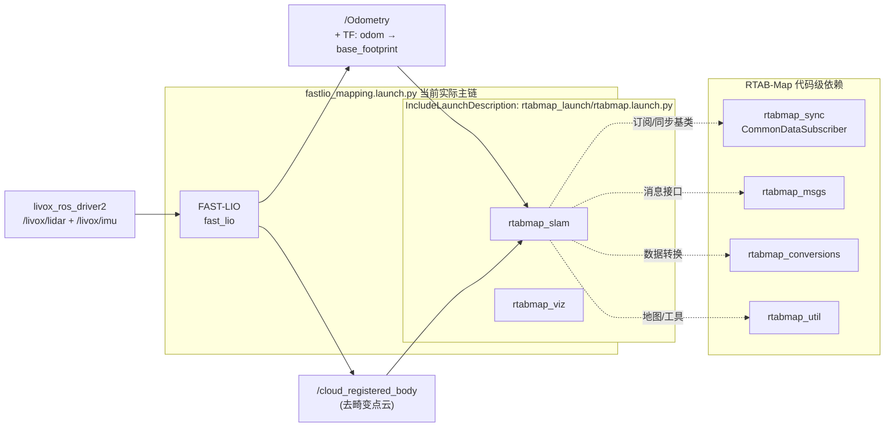
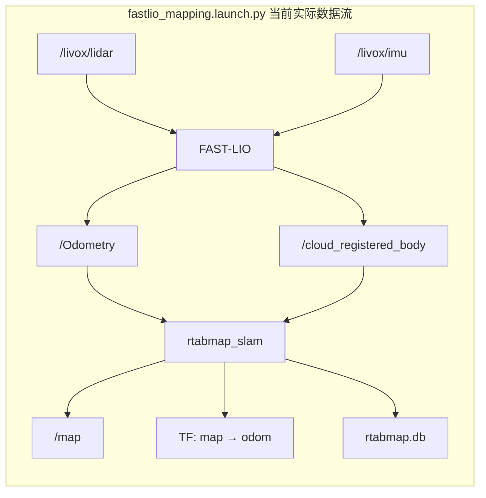
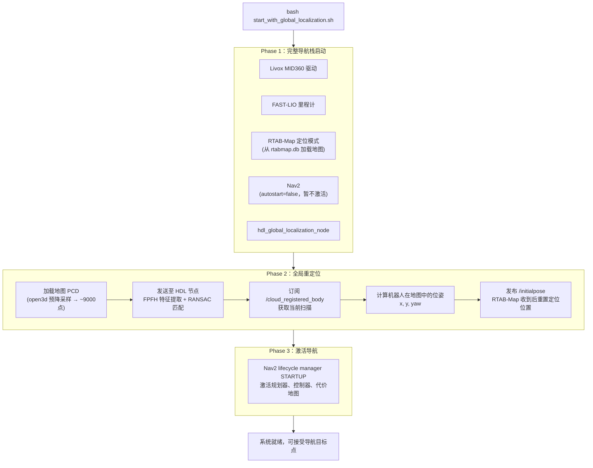

# RTAB-Map 导航项目（从零到一）
官方链接：https://github.com/introlab/rtabmap_ros

本仓库用于落地一套分层清晰的 ROS2 导航方案：

- `FAST-LIO` 负责雷达惯性里程计（发布 `odom -> base_footprint`）
- `RTAB-Map` 负责全局建图/回环/重定位（发布 `map -> odom`）
- `Nav2` 负责规划、控制与避障执行
## 0. 编译与运行环境

### 0.1 运行环境

本项目按以下环境整理和验证：

| 项目 | 版本 / 说明 |
|---|---|
| OS | Ubuntu 22.04 |
| ROS | ROS 2 Humble |
| 机器人平台 | Wheeltec 底盘，Livox MID360 激光雷达 |
| 核心链路 | Livox 驱动 + FAST-LIO + RTAB-Map + Nav2 |
| 导航输入 | RTAB-Map 发布 `/map` 和 `map -> odom`，FAST-LIO 发布 `/Odometry` 和 `odom -> base_footprint` |
| 导航输出 | Nav2 输出 `/cmd_vel_nav`，再经过 `nav2_collision_monitor` 转发到 `/cmd_vel` |

> 运行前请确认已经 source ROS 2 环境：`source /opt/ros/humble/setup.bash`。

### 0.2 编译

```bash
cd ~/xz/rtabmap_nav2_stack
source /opt/ros/humble/setup.bash
bash scripts/do_build_all.sh
```

`scripts/do_build_all.sh` 会先准备 RTAB-Map 0.23.4 的本地库环境，再执行工作空间 `colcon build`。编译完成后，新终端运行前需要执行：

```bash
cd ~/xz/rtabmap_nav2_stack
source install/setup.bash
```

如果修改了 C++ 包、消息/服务接口或 Nav2 插件相关配置，建议清理后重编：

```bash
rm -rf build install log
bash scripts/do_build_all.sh
```

## 1. 仓库结构

```text
rtabmap_nav2_stack/                 # 工作空间
├── src/                            # ROS 2 工作空间源码目录
│   ├── robot_bringup/              # 高级导航启动包组，包含 Nav2 的精细配置
│   │   ├── launch/                 # 启动脚本存放目录
│   │   │   ├── fastlio_mapping.launch.py # 当前建图主入口（FAST-LIO + RTAB-Map）
│   │   │   ├── bringup.launch.py   # 总启动入口，控制全自动导航的各个模块
│   │   │   └── rtabmap_bridge.launch.py # 负责将 RTAB-Map 的输出桥接到 Nav2 栈
│   │   └── config/                 # 核心参数配置目录
│   │       └── nav2_common.yaml    # Navigation 2 配置
│   ├── FAST_LIO_ROS2/              # FAST-LIO 激光惯性紧耦合里程计（提供 odom 和去畸变点云）
│   ├── livox_ros_driver2/          # Livox MID360 雷达驱动
│   └── rtabmap_ros/                # 官方 RTAB-Map ROS 2 包装层
│       ├── rtabmap_launch/         # （done）通用 Launch 入口，  目前的脚本走的就是这个
│       ├── rtabmap_slam/           # （done）SLAM 核心节点，负责建图、回环检测、图优化与重定位
│       ├── rtabmap_odom/           # （done）视觉/深度/激光前端里程计节点，提供局部连续位姿估计
│       ├── rtabmap_sync/           # （done）多传感器时间同步节点，将 RGB、Depth、Scan、IMU 整理成统一输入
│       ├── rtabmap_util/           # （done）点云、栅格、图像和 TF 处理工具节点集合
│       ├── rtabmap_msgs/           # （done）RTAB-Map  ROS 2 消息与服务类型定义
│       ├── rtabmap_conversions/    # （done）RTAB-Map C++ 核心数据结构与 ROS 消息/TF/OpenCV 之间的转换库
│       ├── rtabmap_rviz_plugins/   # （done）RViz 中显示地图图结构、点云、回环和调试信息的插件
│       ├── rtabmap_viz/            # （done）RTAB-Map 自带可视化界面节点，便于查看节点图、回环和局部地图
│       ├── rtabmap_costmap_plugins/# （done）给 Nav2提供3D体素地图能力，
│       ├── rtabmap_python/         # （done）Python 绑定与脚本接口，便于离线分析和轻量二次开发
│       ├── rtabmap_ros/            # （done）元包/聚合包，用于统一依赖导出和整体发布
│       ├── rtsp_camera_bridge/     # （不用理，不是原生包）RTSP 相机桥接节点，把网络视频流接入 ROS 图像话题
│       ├── rtabmap_examples/       # （done）单体传感器或典型设备（如 Realsense）的使用示例
│       └── rtabmap_demos/          # （done）完整机器人的离线建图仿真与演示程序
├── third_party/                    #
│   └── rtabmap-0.23.4/             # RTAB-Map C++ 核心算法源码，保证版本一致性
├── scripts/                        # 编译和配置脚本
│   ├── build_rtabmap_0234.sh       # （done）隔离编译 RTAB-Map 核心层脚本
│   └── use_rtabmap_0234_env.sh     # （done）供 colcon 编译时挂载核心库路径的环境脚本
```

## 2.建图过程  

当前建图主入口为 `fastlio_mapping.launch.py`，使用 FAST-LIO 取代了之前的 icp_odometry + EKF 方案。

### 2.1  包协作过程


```mermaid
flowchart LR
    LIVOX["livox_ros_driver2\n/livox/lidar + /livox/imu"] --> FASTLIO["FAST-LIO\nfast_lio"]
    FASTLIO --> ODOM["/Odometry\n+ TF: odom → base_footprint"]
    FASTLIO --> CLOUD_REG["/cloud_registered_body\n(去畸变点云)"]

    ODOM --> SL
    CLOUD_REG --> SL

    subgraph R1["fastlio_mapping.launch.py 当前实际主链"]
        FASTLIO
        subgraph RTAB_LAUNCH["IncludeLaunchDescription: rtabmap_launch/rtabmap.launch.py"]
            SL["rtabmap_slam"]
            VIZ["rtabmap_viz"]
        end
    end

    subgraph R2["RTAB-Map 代码级依赖"]
        SL -.订阅/同步基类.-> SYNC_BASE["rtabmap_sync\nCommonDataSubscriber"]
        SL -.消息接口.-> MSG["rtabmap_msgs"]
        SL -.数据转换.-> CONV["rtabmap_conversions"]
        SL -.地图/工具.-> UTIL["rtabmap_util"]
    end
```

- FAST-LIO 直接消费 `/livox/lidar` 和 `/livox/imu`，输出激光惯性紧耦合里程计 `/Odometry`，同时发布 `odom -> base_footprint` TF
- FAST-LIO 还输出去运动畸变后的点云 `/cloud_registered_body`，供 RTAB-Map 做回环检测和建图
- `rtabmap_slam` 消费 `/Odometry` 和 `/cloud_registered_body`，执行图优化并发布 `map -> odom` TF
- 不再使用 `icp_odometry`、`robot_localization (EKF)` 等中间环节，链路更短更简洁

### 2.2  关键数据流向


```mermaid
flowchart LR
    subgraph A["fastlio_mapping.launch.py 当前实际数据流"]
        CLOUD["/livox/lidar"] --> FASTLIO["FAST-LIO"]
        IMU1["/livox/imu"] --> FASTLIO
        FASTLIO --> ODOM["/Odometry"]
        FASTLIO --> CLOUD_REG["/cloud_registered_body"]

        ODOM --> SLAM["rtabmap_slam"]
        CLOUD_REG --> SLAM
        SLAM --> MAP["/map"]
        SLAM --> TF1["TF: map → odom"]
        SLAM --> DB1["rtabmap.db"]
    end

```

最终 TF 主链：

```text
map → odom → base_footprint → base_link → livox_frame
 ↑      ↑        (static)       (static)
rtabmap FAST-LIO
```

## 3. 全局重定位与导航启动

### 3.1 新增文件说明

| 文件 | 说明 |
|---|---|
| `src/hdl_global_localization-humble/` | HDL 全局定位 C++ 包（ROS2 Humble 适配版），提供 FPFH+RANSAC 点云匹配服务 |
| `scripts/extract_pcd_from_db.py` | 从 `rtabmap.db` 导出全局点云地图为 PCD 文件 |
| `scripts/global_localization_node.py` | Python 客户端：加载地图 PCD → 调用 HDL 定位服务 → 发布 `/initialpose` |
| `scripts/start_with_global_localization.sh` | **一键启动脚本**，完成三阶段全自动导航启动 |

### 3.2 整体流程


```mermaid
flowchart TD
    A["bash start_with_global_localization.sh"] --> B

    subgraph B["Phase 1：完整导航栈启动"]
        B1["Livox MID360 驱动"]
        B2["FAST-LIO 里程计"]
        B3["RTAB-Map 定位模式\n(从 rtabmap.db 加载地图)"]
        B4["Nav2\n(autostart=false，暂不激活)"]
        B5["hdl_global_localization_node"]
    end

    B --> C

    subgraph C["Phase 2：全局重定位"]
        C1["加载地图 PCD\n(open3d 预降采样 → ~9000点)"]
        C2["发送至 HDL 节点\nFPFH 特征提取 + RANSAC 匹配"]
        C3["订阅 /cloud_registered_body\n获取当前扫描"]
        C4["计算机器人在地图中的位姿\nx, y, yaw"]
        C5["发布 /initialpose\nRTAB-Map 收到后重置定位位置"]
        C1 --> C2 --> C3 --> C4 --> C5
    end

    C --> D

    subgraph D["Phase 3：激活导航"]
        D1["Nav2 lifecycle manager STARTUP\n激活规划器、控制器、代价地图"]
    end

    D --> E["系统就绪，可接受导航目标点"]
```

### 3.3 前置条件：导出全局地图

**建图完成后执行一次**，后续无需重复（地图不变则 PCD 不变）：

```bash
python3 scripts/extract_pcd_from_db.py
# 输出到 cloud_map/rtabmap_<timestamp>_cloud.pcd
```

> 默认读取 `/data/maps/site_a/rtabmap.db`，可通过参数指定：
> `python3 scripts/extract_pcd_from_db.py /path/to/rtabmap.db`

### 3.4 启动导航

```bash
bash scripts/start_with_global_localization.sh
```

可选参数：

```bash
# 指定地图数据库
bash scripts/start_with_global_localization.sh --db /data/maps/site_a/rtabmap.db

# 开启 RViz
bash scripts/start_with_global_localization.sh --rviz
```

### 3.5 关键话题与 TF

| 话题 / TF | 发布者 | 说明 |
|---|---|---|
| `/cloud_registered_body` | FAST-LIO | 当前帧去畸变点云（用于全局定位匹配） |
| `/initialpose` | global_localization_node.py | 全局定位结果，RTAB-Map 订阅后重置位置 |
| `map → odom` TF | RTAB-Map | 接收 `/initialpose` 后从正确位置发布 |
| `odom → base_footprint` TF | FAST-LIO | 连续里程计 |

### 3.6 重定位算法说明

使用 **FPFH + RANSAC** 三维点云全局配准（hdl_global_localization FPFH_RANSAC 引擎）：

1. 对全局地图 PCD 提取 FPFH（Fast Point Feature Histogram）33维局部几何特征
2. 对当前 LiDAR 扫描同样提取 FPFH
3. RANSAC 随机采样特征对应关系，SVD 求解刚体变换
4. 输出机器人在地图坐标系下的 `(x, y, yaw)`，`z/roll/pitch` 强制为 0（地面机器人）

关键参数（已针对室内 ~15m 场景调优）：

| 参数 | 值 | 说明 |
|---|---|---|
| 地图降采样分辨率 | 0.2m | 在 Python 端预处理，避免传输大消息 |
| 法向量估计半径 | 0.5m | 适合室内尺度 |
| FPFH 搜索半径 | 1.5m | 保证特征区分度 |

### 3.7 重定位耗时参考

| 阶段 | 耗时 |
|---|---|
| Phase 1 bringup 等待 | ~10 秒 |
| 地图 PCD 加载 + 发送 | ~2 秒 |
| FPFH 特征计算（地图） | ~30-90 秒（取决于 CPU） |
| RANSAC 匹配 + 发布结果 | ~5-15 秒 |
| **总计** | **约 1-2 分钟** |

### 3.8 停止

`Ctrl+C` 即可，脚本会自动 kill 所有相关进程（包括 rtabmap、fastlio、livox 等子进程）。

## 4. 多路路径点执行

该功能用于在 RViz 中手动取路径点，不使用固定路径库。RViz 使用 `Publish Point` 工具点选多个点，节点订阅 `/clicked_point` 收集路径点，再通过 Nav2 `/follow_waypoints` 执行。

单独启动路径点管理节点，并指定地图：

```bash
source /opt/ros/humble/setup.bash
source /home/wheeltec/xz/rtabmap_nav2_stack/install/setup.bash
ros2 launch robot_bringup multi_waypoint_routes.launch.py map_id:=site_a map_frame_id:=map
```

随导航一起启动，并指定地图：

```bash
source /opt/ros/humble/setup.bash
source /home/wheeltec/xz/rtabmap_nav2_stack/install/setup.bash
ros2 launch robot_bringup bringup.launch.py \
  mode:=navigation \
  database_path:=/data/maps/site_a/rtabmap.db \
  start_multi_waypoint_routes:=true \
  waypoint_map_id:=site_a \
  waypoint_map_frame_id:=map
```

也可以直接用脚本启动，脚本会自动 source 正确工作空间：

```bash
bash scripts/start_multi_waypoint_navigation.sh --map site_workspace --rviz
```

RViz 操作：

1. Fixed Frame 设为 `map`
2. 选择工具栏 `Publish Point`
3. 按顺序在地图上点击多个路径点
4. 在 RViz 中添加 `MarkerArray` 显示，话题选择 `/multi_waypoint_route/markers`

执行当前手动点选的路径：

```bash
ros2 topic pub --once /multi_waypoint_route/command std_msgs/msg/String "{data: 'start'}"
```

控制命令：

```bash
ros2 topic pub --once /multi_waypoint_route/command std_msgs/msg/String "{data: 'undo'}"
ros2 topic pub --once /multi_waypoint_route/command std_msgs/msg/String "{data: 'clear'}"
ros2 topic pub --once /multi_waypoint_route/command std_msgs/msg/String "{data: 'pause'}"
ros2 topic pub --once /multi_waypoint_route/command std_msgs/msg/String "{data: 'resume'}"
ros2 topic pub --once /multi_waypoint_route/command std_msgs/msg/String "{data: 'skip'}"
ros2 topic pub --once /multi_waypoint_route/command std_msgs/msg/String "{data: 'cancel'}"
```

状态与当前点列表：

```bash
ros2 topic echo /multi_waypoint_route/status
ros2 topic echo /multi_waypoint_route/points
```

如果在 RViz 中给目标点后没有出现 Path，可按 `docx/RViz目标点无Path排查README.md` 排查 Nav2 状态、TF、地图、代价地图和禁行区配置。
